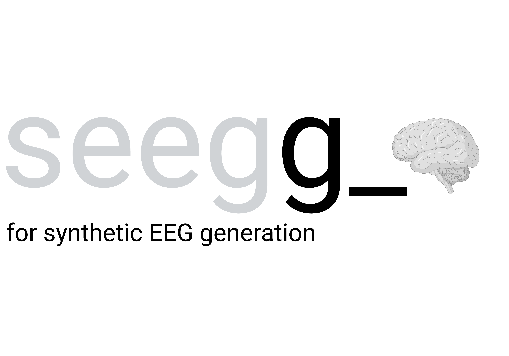

A PyTorch implementation of the DCWGAN-GP (Deep Convolutional Wasserstein GAN with Gradient Penalty) with attention mechanisms for generating synthetic multichannel EEG signals.

## Overview

This project implements the DCWGAN-GP architecture specifically designed for multi-channel EEG signal generation. 

- **Generator**: Deep convolutional architecture with attention-guided synthesis
- **Critic**: Wasserstein GAN critic with gradient penalty for stable training
- **Attention mechanisms**: Spatio-temporal attention for capturing brain signal patterns
- **DCWGAN-GP training**: Wasserstein GAN with gradient penalty for enhanced stability
  

## Features

- Test EEG dataset (real and synthetic)
- Synthetic EEG generator (20 channels)
- Temporal and spatial correlation metrics
- Explainable AI metrics

## Installation

Prerequisites

- Python 3.8+
- CUDA-capable GPU (recommended)
- 8GB+ RAM

Quick install

1. Clone the repository:
```bash
git clone <repository-url>
cd ST_ECoG
```

2. Install dependencies:
```bash
pip install -r requirements.txt
```

3. Install the package in development mode:
```bash
pip install -e .
```

## Usage

1. **Prepare your data**: Place your iEEG/ECoG data in pickle format with shape `(samples, channels, time_points)`

2. **Configure training**: Edit `configs/default_config.yaml` or use the provided training script:
```python
python training_sample.py
```

See our usage_example tutorial.

3. **Monitor training**: Check the output directory for:
   - Loss plots (`plots/losses_epoch_*.png`)
   - Gradient norm plots (`plots/gradient_norms_epoch_*.png`)
   - Generated samples (`generated_data/synthetic_samples.pkl`)

Usage example

```python
from ecog_gan import Generator, WindowCritic, ECoGDataLoader, Trainer, load_config

# Load configuration
config = load_config('configs/default_config.yaml')

# Initialize DCWGAN-GP models
generator = Generator(
    latent_dim=128,
    out_channels=64,
    target_shape=(1, 64, 1536),  # (batch, channels, samples)
    use_attention=True  # Attention-guided synthesis
)

critic = WindowCritic(
    time_window=0.5,
    fs=512,
    channels=64,
    embedding_dim=64,
    use_PE=True  # Positional encoding for temporal patterns
)

# Load data
data_loader = ECoGDataLoader(
    data_path='your_data.pkl',
    seq_len=1536,
    batch_size=64
)

# Initialize trainer
trainer = Trainer(generator, critic, config)

# Start training
trainer.train(data_loader.get_dataloader(), num_epochs=100)
```

### Configuration

The training process is highly configurable through YAML files. Key configuration sections:

#### Model architecture
```yaml
model:
  generator:
    latent_dim: 128
    out_channels: 64
    use_attention: true
  critic:
    time_window: 0.5
    embedding_dim: 64
    use_PE: true
```

#### Training parameters
```yaml
training:
  num_epochs: 100
  critic_iterations: 5
  checkpoint_frequency: 50
```

#### Data processing
```yaml
data:
  seq_len: 1536
  sampling_rate: 512
  batch_size: 64
  preprocessing:
    normalization:
      method: "zscore"
    filtering:
      apply_filtering: true
      bandpass: [1, 100]
```

### Input data

The system expects iEEG/ECoG data in the following format:

- **File format**: Pickle (.pkl) files
- **Data structure**: Dictionary with subject/session keys
- **Shape**: `(samples, channels, time_points)`
- **Data type**: NumPy arrays with float32 precision

Example data structure:
```python
{
    'subject_001': np.array([...]),  # Shape: (n_samples, n_channels, n_timepoints)
    'subject_002': np.array([...]),
    # ...
}
```

### Architecture

#### Generator
- **Input**: Latent vector (128D by default)
- **Architecture**: Transposed convolutions with upsampling
- **Attention**: Optional spatial attention with multiple variants
- **Output**: Synthetic EEG signals

#### Critic
- **Input**: Real or synthetic iEEG signals
- **Architecture**: Window-based processing with attention
- **Attention**: Temporal and spatial attention mechanisms
- **Output**: Realism score for each window

#### Attention mechanisms
- **Spatial Attention**: Captures channel-wise relationships
- **Temporal Attention**: Models time-dependent patterns
- **Positional Encoding**: Learned position embeddings
- **Conditional Attention**: Context-aware attention

### Monitoring and visualization

The training process includes comprehensive monitoring:

- **Loss Tracking**: Generator and critic losses over time
- **Gradient Monitoring**: Gradient norms and clipping statistics
- **Learning Rate Scheduling**: LR decay visualization
- **Sample Generation**: Periodic synthetic sample generation
- **Model Checkpoints**: Automatic model saving
- **Explainable AI methods**: Saliency maps

### Performance tips

1. **GPU Memory**: Adjust batch size based on available GPU memory

### Troubleshooting

Common issues

1. **CUDA Out of Memory**:
   - Reduce batch size
   - Enable gradient checkpointing
   - Use mixed precision training

2. **Training Instability**:
   - Adjust learning rates
   - Increase gradient penalty weight
   - Use different optimizer settings

3. **Data Loading Errors**:
   - Check data format and shape
   - Verify file paths in configuration
   - Ensure proper data preprocessing

## Citation

If you use this code in your research, please cite:

```bibtex
@software{seegg2025,
  title        = {seegg: synthetic EEG generator},
  author       = {Marques, Beatriz and Silveira, Inês and Ao, Nianfei and Silva, Luís and Gamboa, Hugo.},
  year         = {2025},
  url          = {https://github.com/BiosignalsLibphys/seege_},
  version      = {0.1.0},
  note         = {License: GNU LGPLv3}
}


```

## License

This project is licensed under the GNU Lesser General Public License v3.0 - see the LICENSE file for details.
